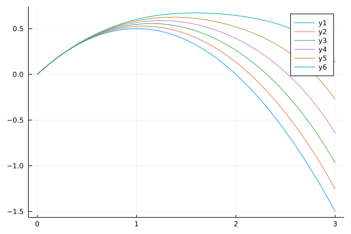
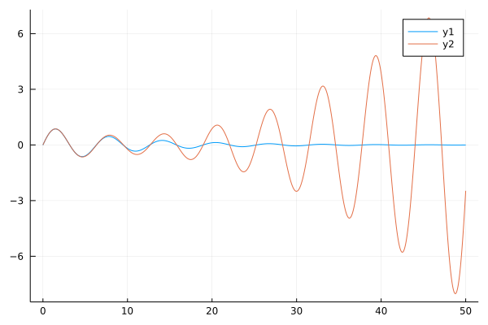

# Using SciML Symbolics to Solve Perturbation Problems

## Background

[**Symbolics.jl**](https://github.com/JuliaSymbolics/Symbolics.jl) is a fast and modern Computer Algebra System (CAS) written in Julia Programming Language. It is part of the [SciML](https://sciml.ai/) ecosystem of differential equation solvers and scientific machine learning packages. While **Symbolics.jl** is primarily designed for modern scientific computing (e.g., machine learning), it is a powerful CAS and can be useful in *classic* scientific computing, like *perturbation* problems.

Perturbation methods are a collection of techniques to solve algebraic and differential equations. The target problems generally don't have a closed solution. However, they depend on a tunable parameter and have closed-form or easy solutions for some values of the parameter. The main idea is to assume a solution as a power series in the tunable parameter (say 𝜀), such that 𝜀 = 0 corresponds to a closed solution.

We will discuss the general steps of the perturbation methods in four examples below. One hallmark of the perturbation method is the generation of long and involved intermediate equations, which are subjected to algorithmic and mechanical manipulations. Therefore, these problems are well suited for CAS. In fact, CAS softwares have been used to help with the perturbation calculations since the 1950s.

In this tutorial our goal is to show how to use Julia and **Symbolics.jl** to solve simple perturbation problems.

## Solving the Quintic

We start with the "hello world!" analog of the perturbation problems: solving the quintic (fifth-order) equations. We want to find 𝑥 such that 𝑥⁵ + 𝑥 = 1. According to the Abel's theorem, a general quintic equation does not have a closed form solution. Of course, we can easily solve this equation numerically; for example, using the Newton's method. Here, we use the following implementation of the Newton's method:

```Julia
using Symbolics, SymbolicUtils

function solve_newton(f, x, x₀; abstol=1e-8, maxiter=50)
    xₙ = Float64(x₀)
    fₙ₊₁ = x - f / Symbolics.derivative(f, x)

    for i = 1:maxiter
        xₙ₊₁ = substitute(fₙ₊₁, Dict(x => xₙ))
        if abs(xₙ₊₁ - xₙ) < abstol
            return xₙ₊₁
        else
            xₙ = xₙ₊₁
        end
    end
    return xₙ₊₁
end
```

In this code, `Symbolics.derivative(eq, x)` does exactly what it names implies: it calculates the symbolic derivative of `eq` (a **Symbolics.jl** expression) with respect to `x` (a **Symbolics.jl** variable). We use `Symbolics.substitute(eq, D)` to evaluate the update formula by substituting variables or sub-expressions (defined as a dictionary `D`) in `eq`. It should be noted that `substitute` is the workhorse of our code and will be used multiple times in the rest of this tutorial. `solve_newton` is written with simplicity and clarity in mind and not performance.

Let's go back to our quintic. We can define a Symbolics variable as `@variables x` and then solve the equation as `solve_newton(x^5 + x - 1, x, 1.0)` (here, `x₀ = 0` is our first guess). The answer is `x = 0.7549`. Now, let's see how we can solve this problem using the perturbation method.

We introduce a tuning parameter 𝜀 into our equation: 𝑥⁵ + 𝑥 = 1. If 𝜀 = 1, we get our original problem. For 𝜀 = 0, the problem transforms to an easy one: 𝑥⁵ = 1 which has a solution 𝑥 = 1 (and four complex solutions which we ignore here). We expand 𝑥 as a power series on 𝜀:

𝑥(𝜀) = 𝑎₀ + 𝑎₁𝜀 + 𝑎₂𝜀² + 𝑂(𝜀³)

𝑎₀ is the solution of the easy equation, therefore 𝑎₀ = 1. Substituting into the original problem,

(1 + 𝑎₁𝜀 + 𝑎₂𝜀²)⁵ + 𝜀 (1 + 𝑎₁𝜀 + 𝑎₂𝜀²) - 1 = 0


Expanding the equations, we get

𝜀 (1 + 5𝑎₁) + 𝜀² (𝑎₁ + 5𝑎₂ + 10𝑎₁²) + 𝑂(𝜀³) = 0

This equation should hold for each power of 𝜀,

1 + 5𝑎₁ = 0,

and

𝑎₁ + 5𝑎₂ + 10𝑎₁² = 0.


We solve the first equation to get 𝑎₁ = -1/5. Substituting in the second one and solve for 𝑎₂:

𝑎₂ = (-1/5 + 10(-(1/5)²) / 5 = -1/25

Finally,

𝑥(𝜀) = 1 - 𝜀 / 5 - 𝜀² / 25 + 𝑂(𝜀³)


Solving the original problem, 𝑥(1) = 0.76, compared to 0.75487767 calculated numerically. We can improve the accuracy by including more terms in the expansion of 𝑥. However, the calculations, while straightforward, become messy and intractable for do manually very quickly. This is why a CAS is very helpful to solve perturbation problems. So, let's see how we can do these calculations in Julia (`test_quintic` function).

Let `n = 2` be the order of the expansion. We start by defining the variables:

```Julia
  @variables @variables ϵ a[1:n]        
```

Then, we define `x = 1 + a[1]*ϵ + a[2]*ϵ^2`. Note that in `test_quintic` we use the helper function `def_taylor` to define `x` by calling it as `x = def_taylor(ϵ, a, 1)`. The next step is to substitute 𝑥 is the problem `y = x^5 + ϵ*x - 1`. Now, `y` is

```Julia
  ϵ*(1 + a₁*ϵ + a₂*(ϵ^2)) + (1 + a₁*ϵ + a₂*(ϵ^2))^5 - 1
```

Or in the expanded form (calculated as `expand(y)`):

```Julia
ϵ + a₁*(ϵ^2) + a₂*(ϵ^3) + (a₁^5)*(ϵ^5) + (a₂^5)*(ϵ^10) + 5a₁*ϵ + 5a₂*(ϵ^2) +
10(a₁^2)*(ϵ^2) + 10(a₁^3)*(ϵ^3) + 5(a₁^4)*(ϵ^4) + 10(a₂^2)*(ϵ^4) +
10(a₂^3)*(ϵ^6) + 5(a₂^4)*(ϵ^8) + 20a₁*a₂*(ϵ^3) + 30a₁*(a₂^2)*(ϵ^5) +
20a₁*(a₂^3)*(ϵ^7) + 5a₁*(a₂^4)*(ϵ^9) + 30a₂*(a₁^2)*(ϵ^4) + 20a₂*(a₁^3)*(ϵ^5) +
5a₂*(a₁^4)*(ϵ^6) + 30(a₁^2)*(a₂^2)*(ϵ^6) + 10(a₁^2)*(a₂^3)*(ϵ^8) +
10(a₁^3)*(a₂^2)*(ϵ^7)
```

We need a way to get the coefficients of different powers of 𝜀. Function `collect_powers(eq, x, ns)` returns the powers of `x` in expression `eq`. Argument `ns` is the range of the powers.

```Julia
function collect_powers(eq, x, ns; max_power=100)
    eq = substitute(expand(eq), Dict(x^j => 0 for j=last(ns)+1:max_power))

    eqs = []
    for i in ns
        powers = Dict(x^j => (i==j ? 1 : 0) for j=1:last(ns))
        push!(eqs, substitute(eq, powers))
    end
    eqs
end
```

For example, `collect_powers(y, ϵ, 1:2)` returns `eqs = [1 + 5a₁, a₁ + 5a₂ + 10(a₁^2)]`. `collect_powers` uses `substitute` to find the coefficient of a given power of `x` by passing a `Dict` with all powers of `x` set to 0, except the target power which is set to 1. To find the coefficient of `ϵ^2` in `y`, we can write

```julia
  substitute(expand(y), Dict(
    ϵ => 0,
    ϵ^2 => 1,
    ϵ^3 => 0,
    ϵ^4 => 0,
    ϵ^5 => 0,
    ϵ^6 => 0,
    ϵ^7 => 0,
    ϵ^8 => 0)
  )
```

The next step is find the coefficients of `ϵ` in the expansion of `x`. **Symbolics.jl** has a function `Symbolics.solve_for` that can solve systems of linear equations. The system described by `eqs` does not seem linear (note `10(a₁^2)` in `eqs[2]`), but upon closer inspection is found to be in fact linear (this is a feature of the permutation method). We can start by solving `eqs[1]` for `a₁` and then substitute it in `eqs[2]` and solve for `a₂`.  This process is done by function `solve_coef(eqs, ps)`:

```julia
function solve_coef(eqs, ps)
    vals = Dict()

    for i = 1:length(ps)
        eq = substitute(eqs[i], vals)
        vals[ps[i]] = Symbolics.solve_for(eq ~ 0, ps[i])
    end
    vals
end
```

Here, `eqs` is an array of expressions (assumed to be equal to 0) and `ps` is an array of variables. The result is a dictionary of variable => value pairs. For example, `solve_coef(eqs, a)` is `Dict(a₁ => -0.2,
a₂ => -0.04)`. We can use larger values of `n` to improve the accuracy of estimations:

| n | x              |
|---|----------------|
|1  |0.8 |
|2  |0.76|
|3  |0.752|
|4  |0.752|
|5  |0.7533|
|6  |0.7543|
|7  |0.7548|
|8  |0.7550|

Remember the numerical value is 0.7549.

The two functions `collect_powers` and `solve_coef(eqs, a)` are used in all the examples in this tutorial and show the main steps in the permutation method.

## Solving the Kepler's Equation

Historically, the perturbation methods were first invented to solve orbital calculations needed to calculate the orbit of the moon and planets. In homage to this history, our second example has a celestial theme. Our goal is solve the Kepler's equation:

𝐸 - 𝑒 sin(𝐸) = 𝑀.  

where 𝑒 is the *eccentricity* of the elliptical orbit, 𝑀 is the *mean anomaly*, and 𝐸 (unknown) is the *eccentric anomaly* (the angle between the position of a planet in an elliptical orbit and the point of periapsis). We want to find a function 𝐸(𝑀; 𝑒). As the first example, it is easy to solve this problem using the Newton's method. For example, let 𝑒 = 0.01671 (the eccentricity of the Earth) and 𝑀 = π/2. We have `solve_newton(x - e*sin(x) - M, x, M)` equals to 1.5875 (compared to π/2 = 1.5708). Now, we try to solve the same problem using the perturbation techniques (see function `test_kepler`.

For 𝑒 = 0, 𝐸 = 𝑀. Therefore, we can use 𝑒 as our perturbation parameter. For consistency, we rename it to 𝜀. We start by defining the variables and 𝑥 (assuming `n = 3`):

```julia
  @variables ϵ M a[1:n]
  x = def_taylor(ϵ, n, M)  
```

The problem equation is `y = E - ϵ * sin(E) - M`. We further simplify by substituting sin with its power series (using `expand_sin` helper function):

sin(𝐸) = 𝑥 - 𝑥³ / 6 + 𝑥⁵ / 120 - 𝑥⁷ / 5040 + 𝑂(𝑥⁹).

We follow the same algorithm as before. We collect the coefficients of the powers of 𝜀:

```
  eqs = collect_powers(y, ϵ, 1:n)
```

and then solve for `a`:

```
  vals = solve_coef(eqs, a)
```

Finally, we substitute `vals` back in `x` to get a formula to calculate `E`:

```
  sol = substitute(x, vals)
  substitute(sol, Dict(ϵ => 0.01671, M => π/2))
```

The result is 1.5876, compared to the numerical value of 1.5875. It is customary to order `sol` based on the powers of `M` instead of `ϵ`. We can calculate this series as `collect_powers(sol, M, 0:3)
`. The result (after cleanup) is

```julia
  E(M, ϵ) =
    (1 + ϵ + ϵ^2 + ϵ^3)*M
    - (ϵ + 4*ϵ^2 + 10*ϵ^3)*M^3/6
    + (ϵ + 16*ϵ^2 + 91*ϵ^3)*M^5/120
```

Comparing the formula to the one for 𝐸 in the [Wikipedia article on the Kepler's equation](https://en.wikipedia.org/wiki/Kepler%27s_equation):


The first deviation is in the coefficient of 𝜀³𝑀⁵.

## The Trajectory of a Ball!

In the first two examples, we applied the permutation method to algebraic problems. However, the main power of the permutation method is to solve differential equations (usually as ODEs, bot occasionally PDEs). Surprisingly, the main procedure developed to solve algebraic problems works well for differential equations. In fact, we will use the same two helper functions, `collect_powers` and `solve_coef`. The main difference is in the way we expand the dependent variables. For algebraic problems, the coefficients of 𝜀 are constants; whereas, for differential equations, they are functions of the dependent variable (usually time).

For the first example of how to solve an ODE, we have chosen a simple and well-behaved problem. The problem is a variation of a standard first-year physics problem: what is the trajectory of an object (say, a ball or a rocket) thrown vertically at velocity 𝑣 from the surface of a planet. Assuming a  constant acceleration of gravity, 𝑔, every burgeoning physicist knows the answer: 𝑥(𝑡) = 𝑣𝑡 - 𝑔𝑡²/2. However, what happens if 𝑔 is not constant? Specifically, 𝑔 is inversely proportional to the distant from the center of the planet. If 𝑣 is large, the assumption of constant gravity does not hold. However, unless 𝑣 is large compared to the escape velocity, the correction is usually small. After simplifications, the problem becomes 𝑥̈(𝑡) = -(1 + 𝜀𝑥(𝑡))⁻², assuming 𝑥(0) = 0, and 𝑥̇(0) = 1. Note that for 𝜀 = 0, it transforms to the standard one.

Let's start with defining the variables

```julia
  @variables ϵ t y[1:n](t) ∂∂y[1:n]
```

Next, we define 𝑥 (for `n = 3`):

```julia
  x = y[1] + y[2]*ϵ + y[3]*ϵ^2
```

We need the second derivative of `x`. It may seem that we can do this using `Differential(t)`; however, this action needs to wait! Instead, we define the dummy variables `∂∂y` as the placeholder for the derivatives and define
```julia
  ∂∂x = ∂∂y[1] + ∂∂y[2]*ϵ + ∂∂y[3]*ϵ^2
```
as the second derivative of `x`. After rearrangement, our governing equation is 𝑥̈(𝑡)(1 + 𝜀𝑥(𝑡))² + 1 = 0, or

```Julia
  eq = ∂∂x * (1 + ϵ*x)^2 + 1
```

The next steps are the same as before (however, note that we pass `0:n-1` to `collect_powers` because the zeroth order term is needed here)

```julia
  eqs = collect_powers(eq, ϵ, 0:n-1)
  vals = solve_coef(eqs, ∂∂y)
```

At this stage,

```julia
  vals = Dict(
    ∂∂y₁ => -1.0,
    ∂∂y₂ => 2.0y₁(t),
    ∂∂y₃ => 2.0y₂(t) - (3.0(y₁(t)^2))
  )
```

Our system of ODEs is forming. Note the triangular form of the relationship. This is time to convert `∂∂`s to the correct **Symbolics.jl** form:

```julia
  D = Differential(t)
  subs = Dict(∂∂y[i] => D(D(y[i])) for i = 1:n)
  eqs = [substitute(first(v), subs) ~ substitute(last(v), subs) for v in vals]
```

Now, `eqs` becomes

```julia
  [Differential(t)(Differential(t)(y₁(t))) ~ -1.0,
   Differential(t)(Differential(t)(y₂(t))) ~ 2.0y₁(t),
   Differential(t)(Differential(t)(y₃(t))) ~ 2.0y₂(t) - (3.0(y₁(t)^2))]
```

We are nearly there! From this point on, the rest is standard ODE solving procedures. Potentially we can use a symbolic ODE solver to find a closed form solution to this problem. However, **Symbolics.jl** currently does not support this functionality. Instead, we solve the problem numerically. We form an `ODESystem`, lower the order (convert second derivatives to first), generate an `ODEProblem` (after passing the correct initial conditions), and, finally, solve it.

```Julia
  using ModelingToolkit, DifferentialEquations

  sys = ODESystem(eqs, t)
  sys = ode_order_lowering(sys)
  prob = ODEProblem(sys, [1.0, 0.0, 0.0, 0.0, 0.0, 0.0], (0, 5.0))
  sol = solve(prob; dtmax=0.01)
```

The solution to the problem can be written as

```julia
  X = ϵ -> sol[y[1]] .+ sol[y[2]] * ϵ .+ sol[y[3]] * ϵ^2
```

The following figure is generated by running
```julia
  using Plots

  plot(sol.t, hcat([X(ϵ) for ϵ = 0.0:0.1:0.5]...))    
```

and shows the trajectories for a range of `ϵ`:



As expected, the higher `ϵ` is (less effective gravity), the object goes higher and stays up for a longer duration. Of course, we could have solved the problem directly using as ODE solver. One of the benefits of the perturbation method is that we need to run the ODE solver only once and then can just calculate the answer for different values of `ϵ`; whereas, if we were using direct method, we needed to run the solver once for each value of `ϵ`.

## A Weakly Nonlinear Oscillator

For our final example, we have chosen a simple example from a very important class of problems, the nonlinear oscillators. As we will see, perturbation theory has difficulty providing a good solution to this problem, but the process is instructive. This example follows closely chapter 7.6 of *Nonlinear Dynamics and Chaos* by Steven Strogatz.

The problem is to solve 𝑥̈(𝑡) + 2𝜀𝑥̇ + 𝑥 = 0, assuming 𝑥(0) = 0, and 𝑥̇(0) = 1. If 𝜀 = 0, the problem reduces to the simple linear harmonic oscillator with the exact solution 𝑥(t) = sin(𝑡). We follow the same steps as the previous example.

```julia
  @variables ϵ t y[1:n](t) ∂y[1:n] ∂∂y[1:n] # n = 3
  x = y[1] + y[2]*ϵ + y[3]*ϵ^2
  ∂x = ∂y[1] + ∂y[2]*ϵ + ∂y[3]*ϵ^2
  ∂∂x = ∂∂y[1] + ∂∂y[2]*ϵ + ∂∂y[3]*ϵ^2
```

Note that now we also need the first derivative terms. Continuing,

```julia
  eq = ∂∂x + 2*ϵ*∂x + x
  eqs = collect_powers(eq, ϵ, 0:n-1)
  vals = solve_coef(eqs, ∂∂y)
```

Let's inspect `vals`:

```julia
  vals = Dict(
    ∂∂y₁ => -y₁(t),
    ∂∂y₂ => -2.0∂y₁ - y₂(t),
    ∂∂y₃ => -2.0∂y₂ - y₃(t))
  )
```

Next, we need to replace `∂`s and `∂∂`s with their **Symbolics.jl** counterparts:

```julia
  D = Differential(t)
  subs1 = Dict(∂y[i] => D(y[i]) for i = 1:n)
  subs2 = Dict(∂∂y[i] => D(D(y[i])) for i = 1:n)
  subs = subs1 ∪ subs2
  eqs = [substitute(first(v), subs) ~ substitute(last(v), subs) for v in vals]
```

We continue with converting to an `ODEProblem`, solving it, and finally plot the results against the exact solution to the original problem.

```julia
  sys = ODESystem(eqs, t)
  sys = ode_order_lowering(sys)
  prob = ODEProblem(sys, [1.0, 0.0, 0.0, 0.0, 0.0, 0.0], (0, 50.0))
  sol = solve(prob; dtmax=0.01)

  T = sol.t
  X = ϵ -> sol[y[1]] .+ sol[y[2]] * ϵ .+ sol[y[3]] * ϵ^2
  Y = ϵ -> exp.(-ϵ*T) .* sin.(sqrt(1 - ϵ^2)*T) / sqrt(1 - ϵ^2)    # exact solution

  plot(sol.t, [Y(0.1), X(0.1)])
```

The result is (compare to Figure 7.6.2 in *Nonlinear Dynamics and Chaos*)



The two curves fit well for the first couple of cycles, but then the perturbation method curve diverges from the true solution. The main reason is that the problem has two or more time-scales.
